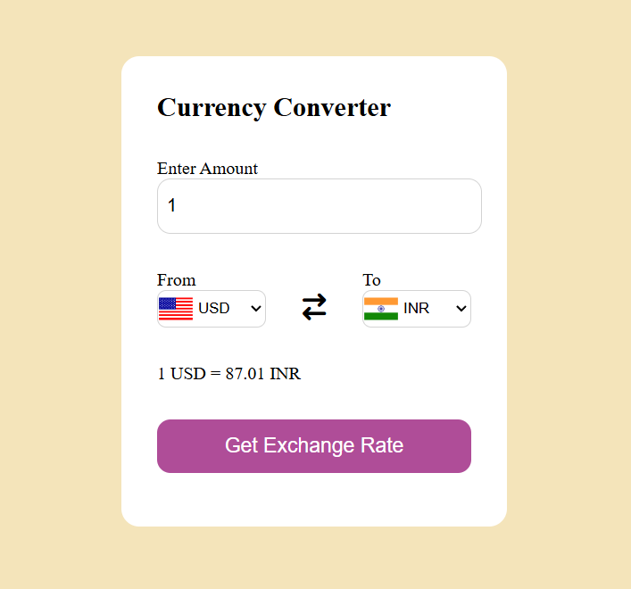
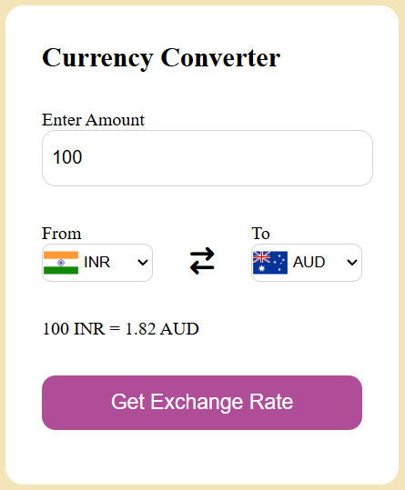

# Currency-Converter

This project is a simple Currency Converter Web Application that allow users to convert currency values between different international currencies. It fetches live exchange rates from an API and displays the converted amount dynamically.

# 📌 Features
- Real-time currency exchange rates
- Dropdown selection for different currencies
- Automatic country flag updates based on selected currency
- Error handling for invalid API responses
- Responsive and user-friendly design

  ## 📸 Preview
  

  

 # ⚙️ Technologies Used
HTML - Structure of the webpage
CSS - Styling and layout
JavaScript - Functionality and API integration
ExchangeRate API - Live currency exchange rates
(Using https://api.exchangerate-api.com/v4/latest/{currency})

# 🚀 How to Run the Project
-Clone the Repository:
git clone https://github.com/Saurabh-html/currency-converter.git
-Navigate to the Project Folder:
cd currency-converter
-Open index.html in a Browser
-Simply double-click index.html or run a local server:
npx http-server 

# 🔧 Setup & API Integration
- The project fetches exchange rates using the ExchangeRate API.
- API request format:
https://api.exchangerate-api.com/v4/latest/USD
- The response contains a list of all exchange rates from the base currency.

 # 📜 License
This project is open-source and available under the MIT License.
